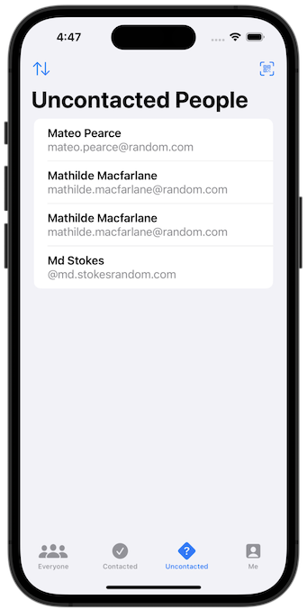

# Project 16 - Hot Prospects

https://www.hackingwithswift.com/100/swiftui/79

Includes solutions to the [challenges](https://www.hackingwithswift.com/books/ios-swiftui/hot-prospects-wrap-up).

## Topics

Custom environment objects, Tab Views, Result, objectWillChange, Image interpolation, Context menus, swipeActions, Local notifications, Swift package dependencies, filter(), map()

## Challenges

From [Hacking with Swift](https://www.hackingwithswift.com/books/ios-swiftui/hot-prospects-wrap-up):

> 1. Add an icon to the “Everyone” screen showing whether a prospect was contacted or not.
> 2. Use JSON and the documents directory for saving and loading our user data.
> 3. Use a confirmation dialog to customize the way users are sorted in each tab – by name or by most recent.

## Screenshots

### Light Mode

### Dark Mode

